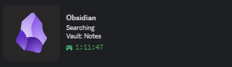
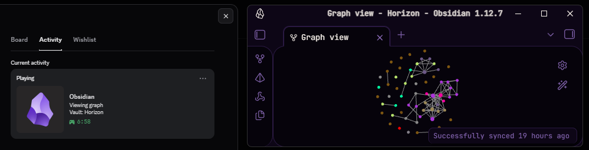
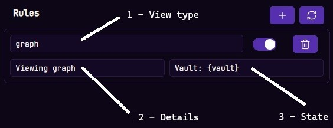
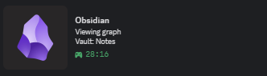
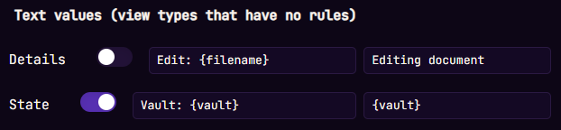
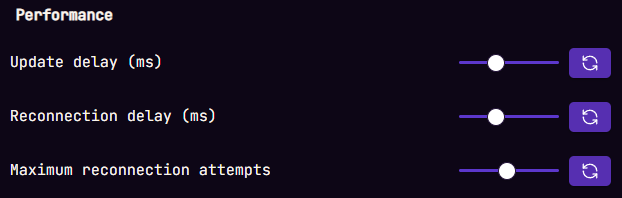
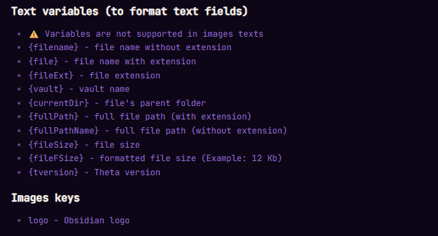
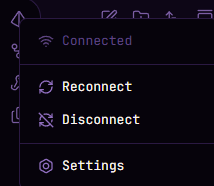

# Theta Discord RPC

Meet, **Theta** – yet another Discord RPC plugin for Obsidian that allows you to display your Obsidian activity directly in your Discord profile.

## 🖼️ Preview

## 🎨 Custom View Rules

**Theta** can process active Views using custom rules to vary your RPC display.

All you need to do is specify the **View Type** that **Theta** should respond to, along with values for the *Details* and *State* fields of your activity.

### Example Rule:

1. **View Type** – `"graph"` – the rule activates when the *Graph View* is active
2. **Details** – `"Viewing graph"` – this value appears in the *Details* field when viewing the graph
3. **State** – `"Vault: {vault}"` – this value appears in the *State* field, with the `{vault}` variable replaced by your current vault name (more on variables below)

### Result in Discord:

## 📝 Default Text Values

The **"Text Values"** parameters control the formatting of Discord RPC fields when the active *View* doesn't match any custom rules.

> ⚠️ **Note:** The left field value displays in RPC when the toggle is **enabled**, and the right field value displays when **disabled**. (Yes, it's a bit confusing – even I forgot why it was designed this way, heh...)

## 🔌 Connection Settings

RPC data updates automatically and after certain settings changes. You can adjust the update frequency in the **"Update delay"** field (default: *20 seconds*).

If **Theta** fails to connect to Discord, it will automatically retry until the limit specified in **"Maximum reconnection attempts"** is reached (default: *50 attempts*). The delay between attempts can be configured in **"Reconnection delay"** (default: *20 seconds*).

**Theta** also features an auto-connect option when opening Obsidian. You can disable this in the **"Connection at startup"** field in settings.

## 🔣 Variables

All *Details* and *State* value fields support variables that get replaced with dynamic information. You can find the full list of variables at the bottom of the settings panel.

> ⚠️ **Important:** Variables are **NOT supported** in image text fields and will not be replaced if used there.

## 🧭 Sidebar Menu

To simplify management, **Theta** includes a menu in the sidebar where you can quickly:
- Connect / Reconnect / Disconnect RPC
- Open plugin settings for detailed configuration

## ⚙️ Client ID

If needed, you can replace the Theta Client ID with your own. Otherwise, **do not touch the "Client ID" parameter**.

## Use of AI

The plugin's foundation was created using Qwen, Alibaba Cloud's AI, and was subsequently edited and polished by WolvesLabs.

---

**have a nice day (👉ﾟヮﾟ)👉**
